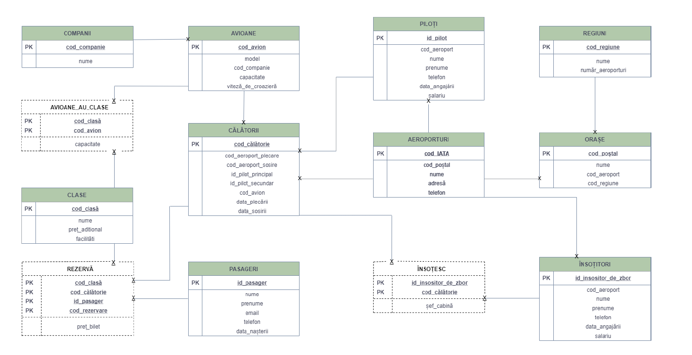

# Airport Database

Implementation of a database for managing the airports in Romania using PL/SQL. The model describes the relationship between internal flights, pilot, passangers, reservations, employees etc. The database has a total of 13 tables and the relationships are as follows:

